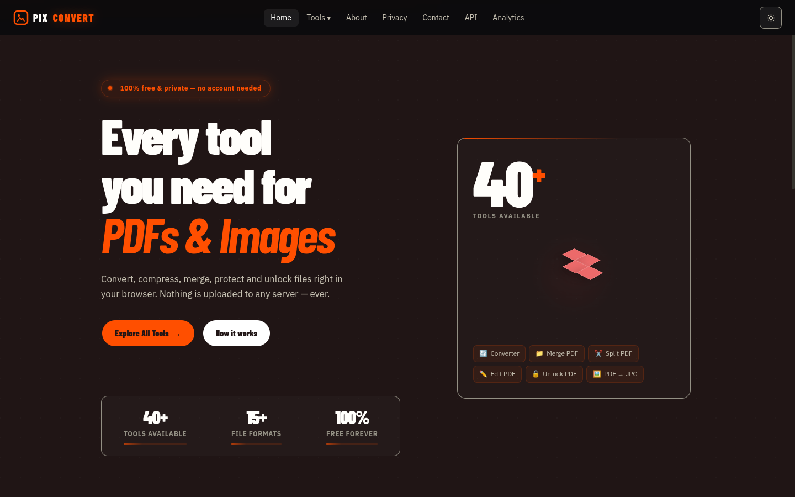
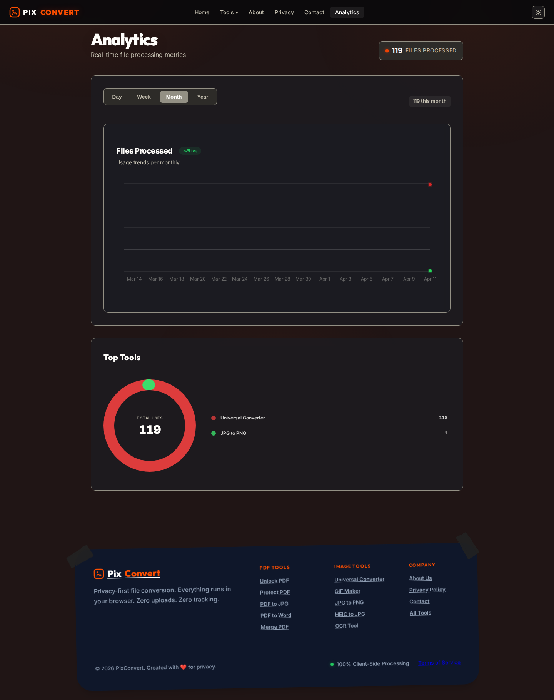
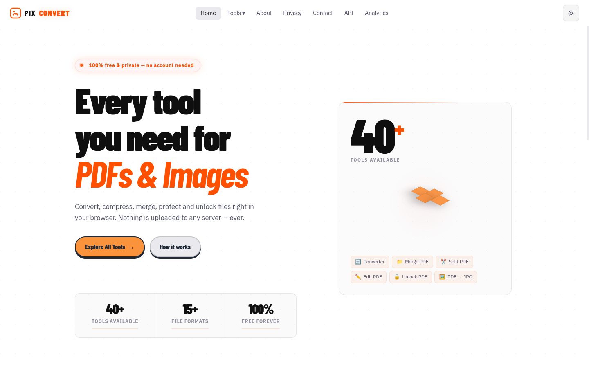

# PixConvert — Every tool you need for PDFs & Images

<p align="center">
  
</p>

PixConvert is a free, privacy-focused, and open-source file conversion ecosystem. It enables users to convert, merge, protect, and edit files entirely in the browser, ensuring no data ever leaves the local environment.

---

## 📦 Installation

### Option 1 — npx (no install, quick test)

```bash
npx pixconvert
```

Server starts on `http://localhost:3001` by default.

---

### Option 2 — npm global install + systemd service (recommended for production)

**1. Install globally**

```bash
npm install -g pixconvert
```

**2. Install systemd service (auto-creates log dirs)**

```bash
sudo pixconvert --install
```

This will:
- Create `/var/log/pixconvert/` for logs
- Write `/etc/systemd/system/pixconvert.service`
- Enable auto-start on boot

**3. Start the server**

```bash
sudo systemctl start pixconvert
```

**4. Manage the service**

```bash
sudo systemctl start pixconvert      # start
sudo systemctl stop pixconvert       # stop
sudo systemctl restart pixconvert    # restart
sudo systemctl status pixconvert     # check status
sudo systemctl enable pixconvert     # enable on boot
sudo systemctl disable pixconvert    # disable on boot
```

**5. View logs**

```bash
# Access log (stdout)
tail -f /var/log/pixconvert/pixconvert_access.log

# Error log (stderr)
tail -f /var/log/pixconvert/pixconvert_error.log
```

**6. Uninstall service**

```bash
sudo pixconvert --uninstall
```

---

### Option 3 — Clone from GitHub

```bash
git clone https://github.com/rushikeshsakharleofficial/pixconvert.git
cd pixconvert
npm install
```

**Run the API server:**

```bash
npm run server
```

**Run the frontend (dev mode):**

```bash
npm run dev
```

**Run both (production-like):**

```bash
npm run build
npm run server
```

**Install as systemd service from source:**

```bash
sudo node bin/pixconvert.js --install
```

---

## ⚙️ Configuration

Set these environment variables before starting (or edit the systemd service file):

| Variable | Default | Description |
|----------|---------|-------------|
| `PORT` | `3001` | API server port |
| `API_RATE_LIMIT` | `10` | Requests per minute per IP |
| `FILE_SIZE_LIMIT_MB` | `50` | Max upload size in MB |
| `FILE_TTL_HOURS` | `1` | Hours before temp files are deleted |

Example with custom port:

```bash
PORT=8080 npx pixconvert
```

---

## 🔧 System Requirements

| Dependency | Purpose |
|------------|---------|
| Node.js 18+ | Runtime |
| Ghostscript | PDF compression, repair |
| LibreOffice headless | Office ↔ PDF conversions |
| Tesseract OCR | OCR tool |

Install on Ubuntu/Debian:

```bash
sudo apt install ghostscript libreoffice tesseract-ocr
```

---

## 🛠️ API

The REST API is available at `http://localhost:3001/api/v1`.

Full API documentation: [API.md](./API.md) or open `http://localhost:3001` in your browser.

---

## ✨ Latest Features

### 📊 Real-time Analytics Dashboard
Powered by Server-Sent Events (SSE), the dashboard provides live metrics on file processing trends. Features high-performance **Glowing Line Charts** and **Animated Donut Charts**.

<p align="center">
  
</p>

### 👻 Animated Ghost 404 Page
A high-quality, animated 404 error page featuring a floating ghost mascot and an interactive **FlowButton** for quick redirection.

<p align="center">
  
</p>

### 🖱️ Smart Navigation
A compact, organized navigation system that categorizes 40+ tools into collapsible sections.

<p align="center">
  
</p>

---

## 🎨 Dual-Theme Support
Seamlessly switch between professional Dark mode and clean Light mode.

<p align="center">
  
</p>

---

## 🛠️ Tech Stack

- **Frontend**: React 19, Vite, TailwindCSS, Framer Motion (High-end animations).
- **Charts**: Recharts with custom SVG filters.
- **Backend**: Node.js, Express 5 (Serverless-ready).
- **Real-time**: Server-Sent Events (SSE) for live metric streaming.
- **Persistence**: Atomic JSON local storage with 2-year data purging.
- **Infrastructure**: Docker, Nginx (Load Balancing), Auto-scaling.

---

## 🚀 Docker

The repo includes a portable production container setup:

- `Dockerfile`: Multi-stage build for frontend and Express server.
- `docker-compose.yml`: Full stack with Nginx edge and persistent volumes.
- `nginx.scaling.conf`: Configured for SSE support and load balancing.

```bash
docker compose up -d
```

---

## 🔒 Privacy First
- **Local Processing**: Heavy file operations happen in-browser via Web Workers.
- **Zero Tracking**: No user-identifiable data is collected.
- **Open Source**: Audit the code yourself.

---

## 📄 License

MIT
